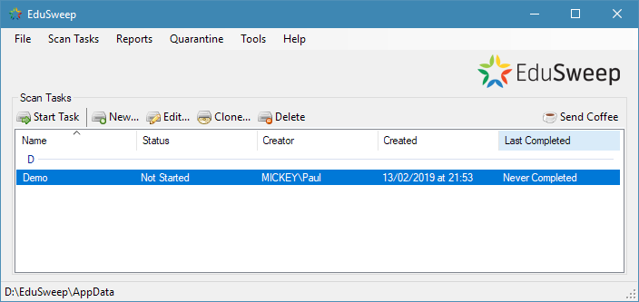

Main Window
###########

Once EduSweep has been started, you will be presented with its main window as
shown below. This window is used for managing and starting existing Scan Tasks,
and for accessing other parts of the application such as reports or the Settings
window.

Scan Tasks
----------
The scan tasks list displays all existing scan tasks. When EduSweep is first
installed this list will be empty as no tasks have been created yet. The *New*
button on the toolbar is used to create a new task that will then be available
from the list.

When a task is selected from the list the *Start Task*, *Edit* and *Delete*
buttons on the toolbar will be enabled, as long as the task is not currently
running.

.. note::
  A new task can be created at any time, but a task cannot be started, edited
  or deleted while it is running.

The buttons on the toolbar provide the following functionality:

- Start Task: Opens the *Task Progress* window to run the selected scan task.

- New: Opens the *New Task* window to create a new scan task.

- Edit: Opens the *Edit Task* window to modify the selected scan task.

- Clone: Creates a copy of the selected task. The cloned task will be created
  with a name in the format: *<OldTaskName> (Copy)*. Once cloned, the
  two tasks are not linked in any way.

- Delete: Removes and permanently deletes the selected scan task.

Menu Bar
--------
The main menu bar at the top of the window is used to access other EduSweep
features.

- File: Just the standard Exit menu item for closing EduSweep.
- Scan Tasks: Provides the same functionality as the Scan Tasks toolbar buttons.
- Reports: Access the Report Manager to view and edit reports.
- Quarantine: Access the Quarantine Manager to view, analyse, remove and restore
  quarantined files.
- Tools: Launch the File Inspector and Signature Studio utilities and access
  application settings.
- Help: Get information about EduSweep and the project.

.. note::
  If utilities were not selected during the EduSweep installation then their
  menu items will be disabled. Reinstall EduSweep to make these available.

Status Bar
----------
The status bar at the bottom of the window displays the working directory - the
location that EduSweep is using for storing its scan tasks, reports, quarantine
files, settings, logs and custom signatures. By default this will be within the
roaming profile of the current user. In a portable installation this will be the
directory containing the main EduSweep executable.
