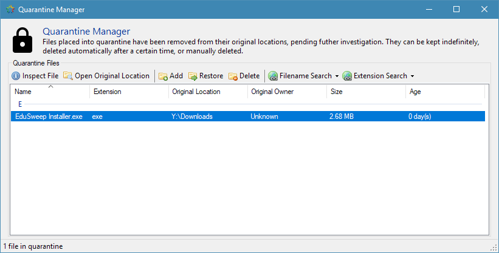

Quarantine Manager
##################

Files can be placed into quarantine if they are supect or if they need to be removed from
their original location yet still preserved for evidence collection. The Quarantine
Manager lists files that have been stored in quarantine following a scan, or those that
have been added manually. It also provides functions for deleting and restoring these
files, as well as local and online resources for finding out more information about them.

Quarantining Files
------------------
When adding a file to quarantine EduSweep will attempt to move it from its original
location. If the file cannot be moved (when it is located on a read-only filesystem, for
example) then the quarantine process will fail and the file will remain in its original
location.

Restoring Files
---------------
Restoring a previously-quarantined file first copies the file to its original location. If
the copy process succeeds then the the file is then deleted from EduSweep's quarantine
along with its metadata. If the file cannot be copied back then the restore process is
aborted and the file remains in quarantine.

The original location of the file is stored as part of the quarantine metadata at the time
that the file is quarantined. If restoring the file from a different machine from the one
on which it was quarantined then be aware that paths may be interpreted differently. For
example, two different, mapped network drives may have the same drive letter on different
machines.

.. note::
    In a standard, non-portable installation the quarantine folder for the current user will
    be part of their roaming profile (%appdata%\EduSweep\Quarantine). Moving large files into
    the quarantine folder can slow down the logon process as these files need to be fetched
    along with the profile.
