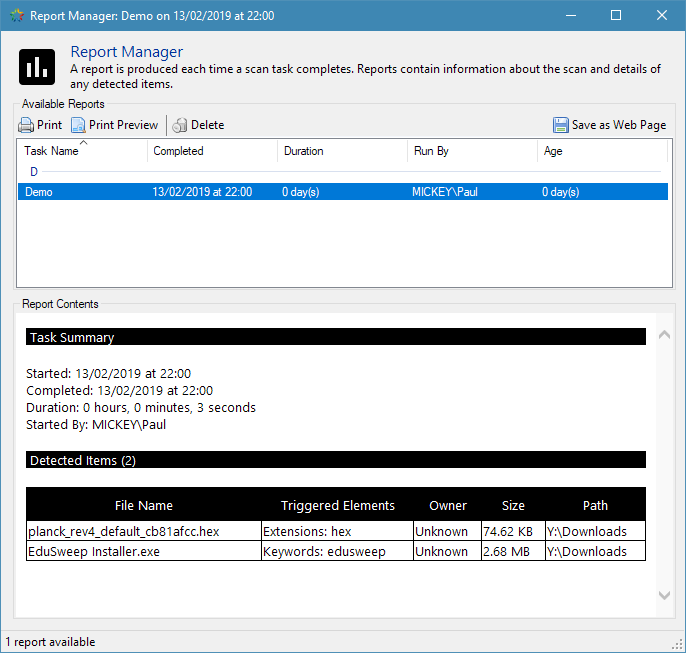

Report Manager
##############

A report is produced each time a scan task completes. The report contains a summary of
the task (start time, duration, etc) along with a list of detected files, if any were
found.

Report contents are displayed in the Report Manager window using an embedded web browser.
The Report Manager also provides functions for removing, printing and exporting reports.

Printing
--------
The HTML-formatted report can be printed directly from EduSweep, avoiding the need to
first export the report and then open it in a separate web browser.

Export
------
Reports can be exported in HTML format for archiving or for viewing in an external web
browser.
