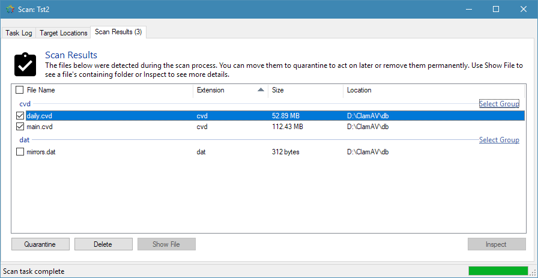

Scan Task Progress
##################

The Task Progress window displays both the state of a running scan task and the
results of the scan task when it has completed. When a scan task is started from
the main window, this scan window will appear and the scan task will begin to
run immediately.

The status bar at the bottom of the window displays the overall status of the
scan and, when the scan is running, the path of the most recently scanned
directory. You can use this to check that the scan is proceeding properly and
is not stalled.

You can pause or cancel the scan at any point before the target directories have
all been scanned and the results are being collated for display.

The window is made up of three tabs - Task Log, Target Locations and
Scan Results, with Task Log being the default.

Task Log Tab
------------
This tab provides logging information about the scan process. Warnings are
highlighted in an orange font, while critical errors are shown in a
bold, red font.

The log entries shown here are filtered according to the logging level that is
configured from the ``Logging`` tab of the ``Settings`` window. When a more
detailed logging level is selected the log file may contain more entries than
the log displayed here, to prevent the sheer volume of log output potentially
slowing down the user interface.

The log scrolls automatically during the scan as events occur.

Target Locations Tab
--------------------
The locations tab displays a list of the top-level directories chosen for
scanning. This list of directories comes from the scan task.

Each top-level directory also shows whether it will be scanned recursively or
not.

The locations are shown as a reminder of what was specified in the scan task;
there are no actions that can be taken from this tab.

Scan Results Tab
----------------
Files shown in this list have been marked as detected by one or more detectors
during the scan process. A file may be detected by more than one detector (for
example, the extension and filename keyword detectors) but it will be shown only
once in the list.

For performance reasons, the list is not populated until the scan process has
completed.

The strip of buttons along the bottom of the tab give you the option of moving
the currently selected files into quarantine or deleting them.

When only a single file is selected, the “Show File” and “Details” buttons are
enabled. These open the file’s location in Explorer and open the File Inspector
utility, respectively.
