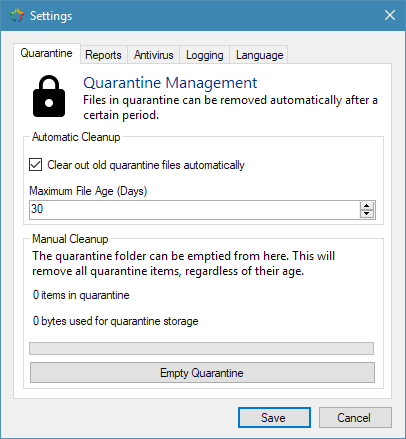
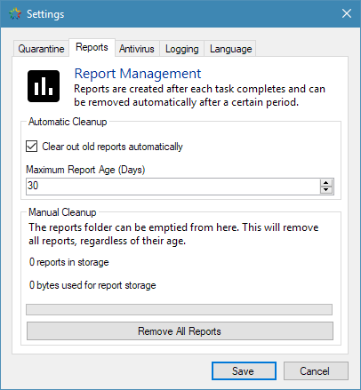
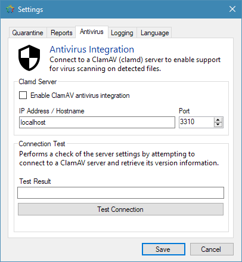
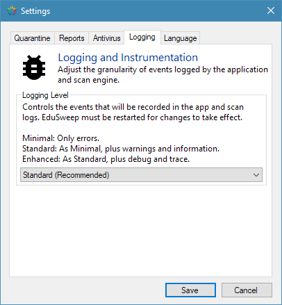
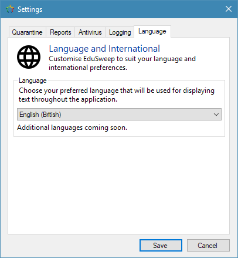

Settings
########

The settings window provides configuration options for EduSweep that affect
reports, quarantined files, logging and antivirus (ClamAV) integration.

Quarantine Tab
--------------

The quarantine tab sets the age limit for quarantine files and whether files
older than this limit should be removed automatically or not. *Age*, in this
context, refers to the number of days since a given file was moved into
quarantine.

The automatic removal, if enabled, occurs each time EduSweep is started.

Regardless of whether automatic removal is enabled or not, the quarantine
folder can be emptied using the *Empty Quarantine* button. This will remove
**all** files from quarantine regardless of their age.

Reports Tab
-----------

The reports tab sets the age limit for reports and whether reports
older than this limit should be removed automatically or not. *Age*, in this
context, refers to the number of days since a given report was generated.

The automatic removal, if enabled, occurs each time EduSweep is started.

Regardless of whether automatic removal is enabled or not, the reports
folder can be emptied using the *Remove All Reports* button. This will remove
**all** reports regardless of their age.

Antivirus Tab
-------------

The antivirus tab manages EduSweep's integration with a ClamAV server (clamd).
If the *Enable ClamAV antivirus integration* checkbox is ticked then ClamAV
integration is enabled at the application level. Scan tasks also provide this
setting at a task level and the two work in combination:

Enabled at application level + Enabled at task level: ClamAV will be used
Enabled at application level + Disabled at task level: ClamAV will not be used
Disabled at application level + Enabled at task level: ClamAV will not be used
Disabled at application level + Disabled at task level: ClamAV will not be used

.. note::
    If ClamAV is going to be used for a scan task then EduSweep will test
    connectivity with the clamd server before beginning the scan process. If
    the server does not respond then ClamAV integration will be disabled for
    the scan, overriding the above settings.

The address and port of the server can be set using the text box and numeric
selector. The address may be given as a hostname (fully-qualified where
possible) or as an IP address. Ensure that the host is reachable from all
machines where EduSweep will be used.

EduSweep defaults to *localhost:3310*, which is appropriate for using EduSweep
on a single machine which is also running clamd locally.

Use the *Test Connection* button to have EduSweep ping the clamd server to check
the specified address and port for correctness.

Logging Tab
-----------

The logging tab allows the level of logging data generated by the application to
be adjusted. This affects both the application log and the logs generated for
scan tasks when they are run.

Reducing the logging level to *Minimal* will reduce the output in both the scan
task log files on disk and the scan task log displayed in the *Task Progress*
window. This option may be desired if you find that the default setting is too
verbose.

Increasing the logging level to *Enhanced* will only affect the log files
(because of the extreme verbosity) and the log in the *Task Progress* window
will not display the additional log output.

In most cases it is sufficient to leave the logging level at its default setting
unless you are encountering issues and requesting support.

Language Tab
------------

The language tab is used to set the language used for the EduSweep interface.
Currently only a single language is available (British English), additional
translations are planned for future releases.