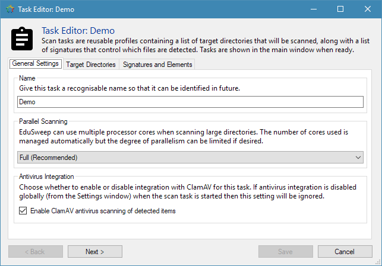
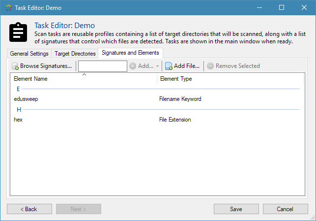

Scan Task Editor
################

Before scanning a directory with EduSweep a *Scan Task* must be created. The *Task Editor*
is used for creating tasks that can be reused multiple times. Refer to the `Scan Tasks`_
document for more information about scan tasks and how they are used in EduSweep.

Creating a scan task can be broken down into three steps:

1. Selecting a name for the task and checking the general settings
2. Adding one or more directories to scan
3. Adding one or more *elements* that will be used for detecting files

Once the task has been created it will be availble from the task list on
the Main Window.

General Settings
----------------

This first tab is used for setting the name of the task, adjusting the
parallel scanning modes and choosing whether to enable antivirus
integration or not.

The task’s name is used to help identify it. Choose a descriptive name such
as “Year 10 Home Folders” so that its purpose is clear and explains loosely
which files will be scanned. This name is also used in the title of the report
that is created after running the task.

The *Parallel Scanning* setting governs the number of threads that EduSweep can use
while scanning directories. Depending on the structure of the directory tree being
scanned and the type of storage, this feature can provide a significant speed increase.
Refer to the `Performance Tuning`_ document for more details on the perrformance considerations
of this feature.

Antivirus Integration controls the state of virus scanning at the scan task level. There is also
a global setting for this which works in combination with the task-level setting. This feature
will only function properly if EduSweep has been configured to communicate with a ClamAV server
(clamd) instance. Refer to the `ClamAV (Antivirus) Integration`_ document for details.

Target Directories
------------------

.. image:: ../../screenshots/tasks/new-targets.png

The locations list contains the directories that will be scanned when running
the task. Directories are scanned recursively - that is, all sub-directories of the
parent directory will be scanned. If this is not what you want then you can either
select individual folders within the parent directory or use an exclusion if there
are only a handful of folders you wish to ignore.
To add a directory to the list, choose “Add Location” from the toolbar immediately
above the locations list and a folder browser dialog will be presented so
that you can select the folder to be scanned. Once you have navigated to the
desired folder, press “OK” on the dialog (“Select Folder” on Windows Vista and
above) and it will be added to the list.
Optionally, you can add some exclusions to the task. An exclusion is a location
that EduSweep will ignore while scanning. A good example of an exclusion
would be a very large folder that only administrators have access to because
the contents are secure and ignoring it will speed up the scan. Tip: You can
double click a location to edit its path.

Signatures and Elements
-----------------------

.. _Scan Tasks : ../concepts/tasks.rst
.. _ClamAV (Antivirus) Integration: ../concepts/clam.rst
.. _Performance Tuning: ../perf.rst
