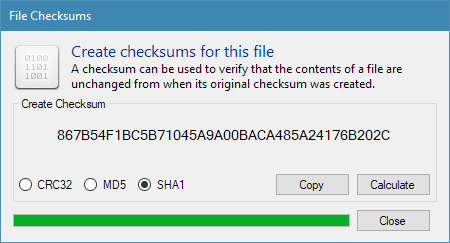

Overview
########

The File Inspector is used to gather detailed information about a selected file.
It provides file system information, such as creation and modification dates for
the selected file, along with an analysis of the file contents. This tool can be
used to check if the purported file type matches its actual content; an innocent-looking
JPEG file may in fact be an executable with a modified extension and the file inspector
can help to detect this kind of scenario.

Inspecting Files
----------------
From left to right the toolbar along the top of the window provides:
  - An “Open...” button which is used to select and loade a file for analysis
  - A Refresh button for reloading the file in case of changes
  - Buttons to move the file to quarantine or delete it permanently
  - An “Execute File” menu for opening the file with its default handler program or in
    Notepad
  - A "File Checksums" button that opens a window to generate checksums

In the lower parts of the window the File Inspector will list the possible file types
that it has detected for the current file along with a confidence value.

.. note::
    Certain pieces of file metadata, such as the detected filetype are determined using a
    heuristic process. Be aware that the result can be incorrect and that some file types
    are easier to accurately detect than others.

    It is much more difficult to determine the file type for text-based formats (e.g. JSON,
    RTF, XML) than it is for binary formats (e.g. PDF, DOC, PNG). The file type may be
    given as "Unknown" for certain text-based file formats.

Generating Checksums
--------------------
The File Inspector can also generate checksums (hashes) for the loaded file using three,
popular hash functions: CRC32, MD5 and SHA-1.

