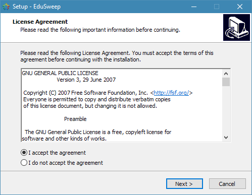

Standard Installation
#####################

Double click on the downloaded MSI file to begin the setup process. The setup
wizard below will launch if the necessary prerequisites are installed on your
system. If the wizard warns you that components required for the installation
are missing then you should first install the Microsoft .NET Framework 3.5
package.

Click Next > to begin the setup process. The installer will proceed to the second
step in which you can select the destination folder into which EduSweep will be
installed. It is safe to install EduSweep onto a drive that is not the boot drive.
Once installed, EduSweep will not require write access to its installation folder.
4

Once you are happy with the selected location choose Next > again to proceed
to the next step. The following screen offers a final chance to cancel the
installation before proceeding to copy files. Choose Install to continue.

Windows Vista, 7, 2008: If User Account Control (UAC) is enabled on the
computer then you will be prompted to provide permission to install the software
by a dialog similar to the one shown below. If you choose No then the
installation will be canceled and EduSweep will not be installed. Choose Yes
to proceed with the installation.

At this stage the files required for EduSweep to run will be copied to the destination
folder that was selected earlier in the installation process.

Once the file copy process completes the installation is finished and EduSweep
can be started from its corresponding entry in the Start Menu (Start -> EduSweep
-> EduSweep 2.5) or simply by typing “EduSweep” into the Start Menu’s search
box.
