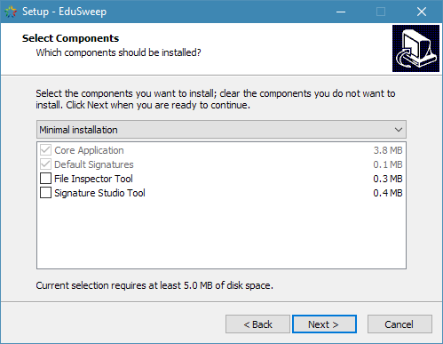
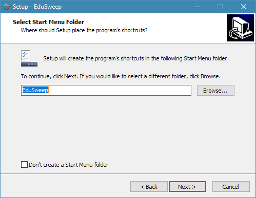
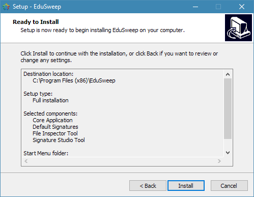
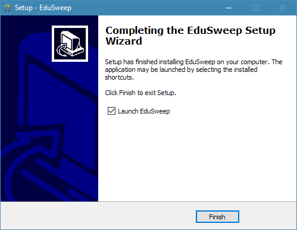

Standard Installation
#####################

The EduSweep installer is provided as an executable (exe) setup program. The default name
for the program is "EduSweep Installer.exe".

Please review the requirements and prerequisites before beginning the installation process.

Double click on the downloaded installer file to begin the setup process.
If User Account Control (UAC) is enabled then you will be prompted to provide elevated
permissions to install the software. If you choose No then the installation will be
cancelled and EduSweep will not be installed. Choose Yes to proceed with the installation.

The setup wizard below will launch if the necessary prerequisites are installed on your
system.

License Acceptance
------------------
.. image:: ../../screenshots/installer/1.png

The first page of the installer prompts you to accept the terms of the license that EduSweep
is provided under. Review these terms carefully and press Next > to indicate acceptance if
you agree.

Directory Selection
-------------------

On the second page you can modify the directory into which EduSweep will be installed.
EduSweep does not require write access to this folder after the installation is completed.
Modify the directory path, or accept the proposed default, and choose Next > to proceed.

Component Selection
-------------------

Select from a full installation (which includes the File Inspector and Signature Studio
utilities), a minimal installation (which omits both utilities) or a custom installation
that allows you to choose components manually.

The core EduSweep application and its collection of default signatures are always required
and cannot be deselected. Even in a minimal installation these are selected as shown above.

Start Menu Shortcuts
--------------------

By default the installer will create Start Menu shortcuts for the EduSweep application and
any utilities that were selected in the previous step. You may clear the checkbox in order
to prevent the creation of these shortcuts.

Portable Installation
---------------------

The installer offers to install in portable mode. This option is not enabled by default.
Portable mode will install to the specified folder but without registering the application
with Windows. Application data will be stored within the install folder instead of in the
users' roaming profile.

Review Installation Options
---------------------------

This page offers a chance to review the installation options and to cancel the
installation if needed. Choose Install to continue and to install the application and any
selected components.

At this stage the files required for EduSweep to run will be copied to the destination
folder that was selected earlier in the installation process.

Completion
----------

Once the file copy process completes the installation is finished and EduSweep
can be started from its Start Menu shortcut. The installer offers to start EduSweep
immediately as well.
